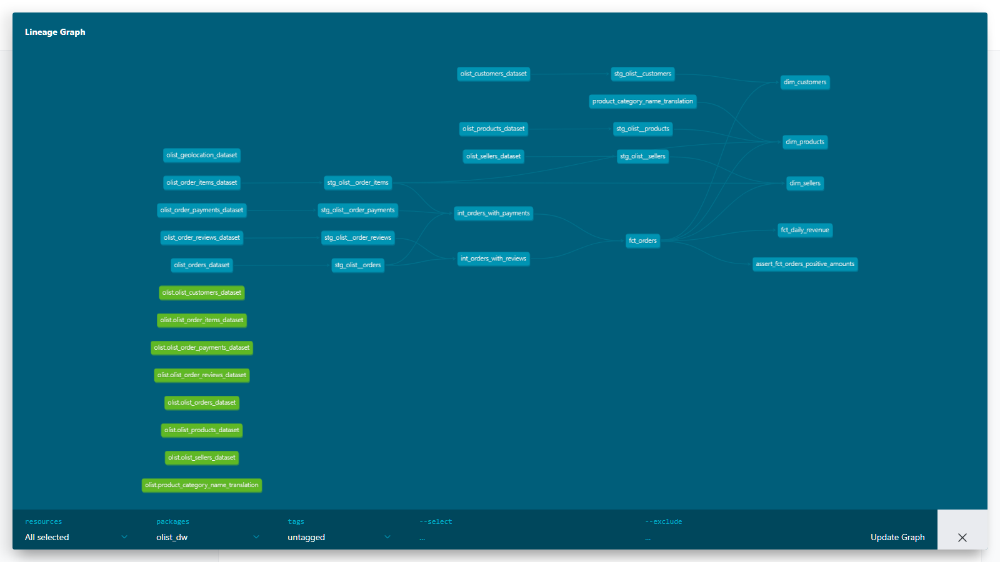

# Olist E-Commerce Data Warehouse

A dbt + DuckDB data warehouse built on the Brazilian Olist e-commerce dataset (2016-2018), enabling analysis of seller performance, customer lifetime value, delivery efficiency, and revenue trends across ~100k orders.

 



---

## Architecture

```mermaid
flowchart LR
    subgraph seeds["Seeds (CSV)"]
        s1[olist_orders_dataset]
        s2[olist_customers_dataset]
        s3[olist_order_items_dataset]
        s4[olist_order_payments_dataset]
        s5[olist_order_reviews_dataset]
        s6[olist_products_dataset]
        s7[olist_sellers_dataset]
        s8[product_category_name_translation]
    end

    subgraph staging["Staging (views)"]
        st1[stg_olist__orders]
        st2[stg_olist__customers]
        st3[stg_olist__order_items]
        st4[stg_olist__order_payments]
        st5[stg_olist__order_reviews]
        st6[stg_olist__products]
        st7[stg_olist__sellers]
    end

    subgraph intermediate["Intermediate (ephemeral)"]
        i1[int_orders_with_payments]
        i2[int_orders_with_reviews]
    end

    subgraph marts["Marts (tables)"]
        m1[fct_orders]
        m2[fct_daily_revenue]
        m3[dim_customers]
        m4[dim_products]
        m5[dim_sellers]
    end

    seeds --> staging
    staging --> intermediate
    intermediate --> marts
    staging --> marts
```



---

## Data Model

| Model | Layer | Grain | Approx. Rows | Description |
|---|---|---|---|---|
| `fct_orders` | finance | 1 row per order | 99,441 | Main fact table with payment, delivery, and review metrics per order |
| `fct_daily_revenue` | finance | 1 row per day | ~700 | Daily revenue aggregates for delivered orders only |
| `dim_customers` | core | 1 row per unique customer | ~96,000 | Customer dimension with lifetime value and purchase history |
| `dim_products` | core | 1 row per product | 32,951 | Product catalog enriched with English category names and sales metrics |
| `dim_sellers` | core | 1 row per seller | 3,095 | Seller performance metrics including on-time delivery rate and revenue |

---

## Key Metrics Available

1. **Revenue by day / week / month** - `fct_daily_revenue.total_revenue` grouped by `order_date`
2. **Average order value** - `fct_daily_revenue.avg_order_value` or `avg(fct_orders.total_amount)`
3. **On-time delivery rate by seller** - `dim_sellers.on_time_delivery_rate`, the proportion of orders delivered before the estimated date
4. **Average delivery time** - `dim_sellers.avg_delivery_days` or `avg(fct_orders.delivery_days)` filterable by state or product category
5. **Customer lifetime value** - `dim_customers.total_spend` combined with `customer_lifetime_days`
6. **Top product categories by revenue** - join `dim_products.category_name_en` with `fct_orders` via `stg_olist__order_items`
7. **Review score distribution** - `fct_orders.review_score` grouped by `order_status`, seller, or category
8. **Late delivery rate over time** - `sum(fct_orders.is_late_delivery) / count(*)` grouped by `purchased_at` truncated to month
9. **Repeat customer rate** - customers in `dim_customers` where `total_orders > 1`
10. **Freight as percentage of revenue** - `sum(total_freight) / sum(total_amount)` from `fct_orders` or `fct_daily_revenue`

---

## Stack

| Tool | Version | Purpose |
|---|---|---|
| dbt-core | 1.11.7 | Data transformation and orchestration |
| dbt-duckdb | 1.10.1 | DuckDB adapter for dbt |
| DuckDB | embedded | Analytical database engine |
| Python | 3.x | Runtime for dbt CLI |

---

## Setup and Reproduction

### Requirements

- Python 3.9+
- pip

### Installation

```bash
git clone <this-repo>
cd olist_dw
pip install dbt-duckdb==1.10.1
dbt deps
```

### Load seed data

```bash
dbt seed
```

### Run all models

```bash
dbt run
```

### Run tests

```bash
dbt test
```

### Generate and serve documentation

```bash
dbt docs generate
dbt docs serve
```

Then open http://localhost:8080 in your browser to explore the DAG and model documentation.

---

## Project Structure

```
OlistProject/
|-- docs/
|   `-- dag_screenshot.png
`-- olist_dw/
    |-- dbt_project.yml               # Project configuration and materializations
    |-- packages.yml                  # dbt package dependencies
    |-- seeds/                        # Raw CSV data loaded into DuckDB
    |   |-- olist_orders_dataset.csv
    |   |-- olist_customers_dataset.csv
    |   |-- olist_order_items_dataset.csv
    |   |-- olist_order_payments_dataset.csv
    |   |-- olist_order_reviews_dataset.csv
    |   |-- olist_products_dataset.csv
    |   |-- olist_sellers_dataset.csv
    |   `-- product_category_name_translation.csv
    |-- models/
    |   |-- staging/
    |   |   `-- olist/
    |   |       |-- _olist__sources.yml          # Source definitions
    |   |       |-- _olist__models.yml           # Staging model docs and tests
    |   |       |-- stg_olist__orders.sql
    |   |       |-- stg_olist__customers.sql
    |   |       |-- stg_olist__order_items.sql
    |   |       |-- stg_olist__order_payments.sql
    |   |       |-- stg_olist__order_reviews.sql
    |   |       |-- stg_olist__products.sql
    |   |       `-- stg_olist__sellers.sql
    |   |-- intermediate/
    |   |   `-- ecommerce/
    |   |       |-- int_orders_with_payments.sql
    |   |       `-- int_orders_with_reviews.sql
    |   `-- marts/
    |       |-- finance/
    |       |   |-- _finance__models.yml
    |       |   |-- fct_orders.sql
    |       |   `-- fct_daily_revenue.sql
    |       `-- core/
    |           |-- _core__models.yml
    |           |-- dim_customers.sql
    |           |-- dim_products.sql
    |           `-- dim_sellers.sql
    `-- tests/
        `-- assert_fct_orders_positive_amounts.sql
```

---

## Design Decisions

**Why staging as views and marts as tables?** Staging models are thin wrappers over seeds - they just rename and cast columns. Materializing them as views costs nothing at query time because they reference seeds (tables already in DuckDB). Mart models, on the other hand, involve multi-table joins and aggregations over 100k+ rows. Materializing them as tables means downstream queries hit pre-computed results, which matters especially for `dim_customers` which joins across the full orders history.

**Why intermediate as ephemeral?** The two intermediate models (`int_orders_with_payments`, `int_orders_with_reviews`) exist purely to break up complexity in `fct_orders`. They have no independent business use, so there is no reason to materialize them as separate objects in DuckDB. Ephemeral means they compile as CTEs inside the mart model that references them, keeping the warehouse clean without sacrificing readability in the dbt project.

**Why DuckDB instead of a cloud warehouse?** The Olist dataset is a fixed historical CSV export. There is no streaming ingestion, no multi-user concurrency requirement, and no production SLA. DuckDB runs embedded in the file system, requires zero infrastructure, handles 100k+ row analytical queries in milliseconds, and produces a single portable `.duckdb` file that can be shared or checked in. For a portfolio or learning project this is strictly better than spinning up Snowflake or BigQuery.

**Naming conventions.** The project follows the dbt naming standard: `stg_` prefix for staging (one-to-one with source tables), `int_` for intermediate logic that does not belong in a mart, `fct_` for fact tables (grain is a business event, here an order), and `dim_` for dimensions (descriptive attributes of an entity). Double underscores separate the source name from the entity in staging (`stg_olist__orders`) to make the lineage readable at a glance.

---

## Testing Strategy

The project has 57 generic tests and 1 singular test across all layers.

**Staging tests** validate that primary keys are not null (and unique where the source guarantees it), that foreign keys are not null, and that critical financial fields like `price` and `freight_value` are populated. The `review_id` uniqueness test was intentionally omitted after discovering the source dataset contains 789 duplicate review IDs - a documented data quality issue in the raw Olist data.

**Mart tests** validate uniqueness and not-null on all primary keys (`order_id`, `customer_unique_id`, `product_id`, `seller_id`, `order_date`). `fct_orders.order_status` has an `accepted_values` test covering all 8 known statuses. Boolean columns `has_review`, `is_late_delivery`, and `is_delivered` are tested not-null to ensure no computation errors in the CASE expressions.

**Singular test** (`assert_fct_orders_positive_amounts`) catches any delivered order where `total_amount` is recorded but is zero or negative - which would indicate a payment data corruption issue. Orders with no payment record at all (null `total_amount`) are excluded from this test because a small number of them exist in the source data.

---

## What I Learned

The hardest part was not the SQL. I expected the SQL to be the challenge, but most of it came together quickly once I understood the grain of each model. The actual friction came from the layer boundaries - figuring out what belongs in staging versus intermediate versus a mart, and why it matters. The first time I tried to put the delivery_days calculation directly in the staging layer it felt logical, but then I realized staging should know nothing about business logic. That click moment helped a lot.

I also did not expect the source data to be messy. The `review_id` column looked like a primary key but had 789 duplicates. The products table had typos (`product_name_lenght` instead of `product_name_length`). A handful of delivered orders have no payment record at all. None of this is a dbt problem, it is just real data, and dealing with it made me understand why the staging layer exists - to document and isolate these issues in one place rather than discovering them buried inside a mart.

The ephemeral materialization concept took me two reads of the docs to understand. My mental model was "ephemeral means it does not run", which is wrong. It means it runs as a CTE inside whatever model references it. Once I understood that, the decision of what to make ephemeral became obvious: anything that is only useful as a building block for one other model.

Learning to read dbt test output was its own skill. At first I was trying to guess what failed from the test name alone. The compiled SQL in `target/compiled/` is what actually tells you what the test is checking - once I started reading that file first, debugging dropped from minutes to seconds.
